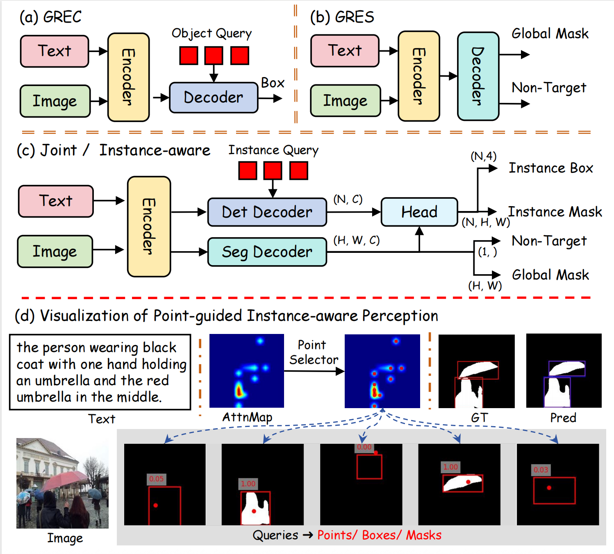

#  Improving Generalized Visual Grounding with Instance-aware Joint Learning

## Updates

- **2025.10.05: The codes and models are released.**
- **2025.09.05: Our work has been accepted by TPAMI 2025.**

## Abstract
Generalized visual grounding tasks, including Generalized Referring Expression Comprehension (GREC) and Segmentation (GRES), extend the classical visual grounding paradigm by accommodating multi-target and non-target scenarios. Specifically, GREC focuses on accurately identifying all referential objects at the coarse bounding box level, while GRES aims to achieve fine-grained pixel-level perception. However, existing approaches typically treat these tasks independently, overlooking the benefits of jointly training GREC and GRES to ensure consistent multi-granularity predictions and streamline the overall process. Moreover, current methods often treat GRES as a semantic segmentation task, neglecting the crucial role of instance-aware capabilities and the necessity of ensuring consistent predictions between instance-level boxes and masks. To address these limitations, we propose InstanceVG, a multi-task generalized visual grounding framework equipped with instance-aware capabilities, which leverages instance queries to unify the joint and consistency predictions of instance-level boxes and masks. To the best of our knowledge, InstanceVG is the first framework to simultaneously tackle both GREC and GRES while incorporating instance-aware capabilities into generalized visual grounding. To instantiate the framework, we assign each instance query a prior reference point, which also serves as an additional basis for target matching. This design facilitates consistent predictions of points, boxes, and masks for the same instance. Extensive experiments obtained on ten datasets across four tasks demonstrate that InstanceVG achieves state-of-the-art performance, significantly surpassing the existing methods in various evaluation metrics.

## FrameWork
 

## Installation
CUDA=11.8
torch=2.0.0
torchvision=0.15.1

### Prerequisites

```bash
pip install -r requirements.txt
```

Our code depends on parts of [detrex](https://detrex.readthedocs.io/en/latest/tutorials/Installation.html) and [detectron2](https://github.com/facebookresearch/detectron2), so you need to install and compile them.
```
python -m pip install 'git+https://github.com/facebookresearch/detectron2.git'
git clone https://github.com/IDEA-Research/detrex.git
cd detrex
git submodule init
git submodule update
pip install -e .
```

Then install InstanceVG package in editable mode:
```bash
pip install -e .
```


### Data Preparation

Prepare the mscoco dataset, then download the referring annotations and foreground annotations in [Models Zoo](###models-zoo).

The data structure should look like the following:
```
| -- data
    |--seqtr_type
        | -- annotations
            | -- mixed-seg
                | -- instances_nogoogle_withid.json
            | -- grefs
                | -- instance.json
            | -- ref-zom
                | -- instance.json
            | -- rrefcoco
                | -- instance.json

        | -- images
            | -- mscoco
                | -- train2014
```

### Pre-trained Weights

`InstanceVG` utilizes the [BEiT-3](https://github.com/microsoft/unilm/blob/master/beit3/README.md) model as both the backbone and the multi-modality fusion module. The pre-trained weights can be downloaded from [this link](https://github.com/microsoft/unilm/blob/master/beit3/README.md#download-checkpoints). Additionally, you will need to download the [tokenizer](https://github.com/microsoft/unilm/blob/master/beit3/README.md#text-tokenizer) for BEiT-3.

First, create a directory for the pre-trained weights:

```
mkdir pretrain_weights
```
Place the BEiT checkpoints and tokenizer within this directory.

```
pretrain_weights
|—— beit3_base_patch16_224.zip
|—— beit3_large_patch16_224.zip
└── beit3.spm
```


The final directory structure of InstanceVG should resemble the following:
```
InstanceVG
├── asserts
├── configs
├── data
├── pretrain_weights
├── instancevg
└── tools
```

## Demo

Here, demo for InstanceVG are provided.

The following scripts can be used to test on the GRES task.
```bash
python tools/demo.py --img "asserts/imgs/Figure_1.jpg"  --expression "three skateboard guys" --config  "configs/gres/InstanceVG-grefcoco.py"  --checkpoint  /PATH/TO/InstanceVG-grefcoco.pth 
```

The following scripts can be used to test on the RIS task.
```bash
python tools/demo.py --img "asserts/imgs/Figure_2.jpg"  --expression "full half fruit" --config  "configs/refcoco/InstanceVG-refcoco.py"  --checkpoint  /PATH/TO/InstanceVG-refcoco.pth 
```

For loading alternative pretrained weights or adjusting threshold settings, please consult the `tools/demo.py`.


## Training

If you want to retrain the model, you can run the following scripts:
```bash
bash tools/dist_train.sh [PATH_TO_CONFIG] [GPU_NUMBER]
```


## Evaluation

If you want to reproduce the result, download it and then run the following scripts:
```bash
bash tools/dist_test.sh [PATH_TO_CONFIG] [GPU_NUMBER] --load-from [PATH_TO_CHECKPOINT_FILE]
```

### Models ZOO

We release the checkpoint and dataset annotation in the huggingface. [CHECKPOINTS](https://huggingface.co/Dmmm997/InstanceVG), [DATASET](https://huggingface.co/datasets/Dmmm997/InstanceVG-Data)

| Train Set | Checkpoint|
| --------- | --------- |
| RefCOCO/+/g  | InstanceVG-B-refcoco.pth |
| RefCOCO/+/g  | InstanceVG-L-refcoco.pth | 
| gRefCOCO  | InstanceVG-grefcoco.py |
| Ref-ZOM  | InstanceVG-refzom.pth |
| RRefCOCO  | InstanceVG-rrefcoco.pth |


Reproduce the RefCOCO/+/g in InstanceVG-B result using this script:
```bash
bash tools/dist_test.sh  configs/refcoco/InstanceVG-B-refcoco/InstanceVG-B-refcoco.py  1 --load-from  work_dir/refcoco/InstanceVG-B-refcoco/InstanceVG-B-refcoco.pth
```

Reproduce the RefCOCO/+/g in InstanceVG-L result using this script:
```bash
bash tools/dist_test.sh  configs/refcoco/InstanceVG-L-refcoco/InstanceVG-L-refcoco.py  1 --load-from  work_dir/refcoco/InstanceVG-L-refcoco/InstanceVG-L-refcoco.pth
```

Reproduce the gRefCOCO result using this script:
```bash
bash tools/dist_test.sh   configs/gres/InstanceVG-grefcoco.py 1 --load-from  work_dir/gres/InstanceVG-grefcoco/InstanceVG-grefcoco.pth 
```

Reproduce the Ref-ZOM result using this script:
```bash
bash tools/dist_test.sh  configs/refzom/InstanceVG-refzom.py  1 --load-from  work_dir/refzom/InstanceVG-refzom/InstanceVG-refzom.pth
```

Reproduce the RRefCOCO result using this script:
```bash
bash tools/dist_test.sh  configs/rrefcoco/InstanceVG-rrefcoco.py  1 --load-from  work_dir/rrefcoco/InstanceVG-rrefcoco/InstanceVG-rrefcoco.pth
```


### Acknowledge
This repository partially builds upon the codebases of [SimVG](https://github.com/Dmmm1997/SimVG/), [BEiT-3](https://github.com/microsoft/unilm/tree/master/beit3) and [SeqTR](https://github.com/seanzhuh/SeqTR).

## Citation
```
@ARTICLE{instancevg,
  author={Dai, Ming and Cheng, Wenxuan and Liu, Jiang-Jiang and Yang, Lingfeng and Feng, Zhenhua and Yang, Wankou and Wang, Jingdong},
  journal={IEEE Transactions on Pattern Analysis and Machine Intelligence}, 
  title={Improving Generalized Visual Grounding with Instance-aware Joint Learning}, 
  year={2025},
  doi={10.1109/TPAMI.2025.3607387}}
```